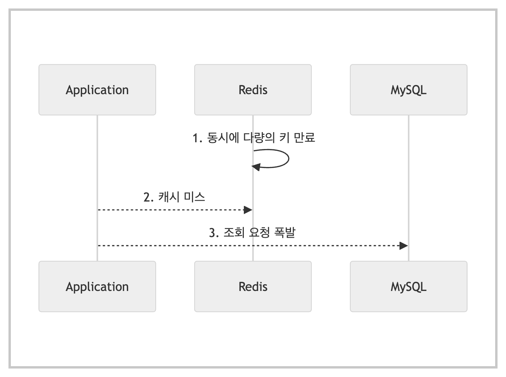

# 📚 Cache

---

## 1. 주제/키워드 
- 캐시와 redis에 대해 알아보자!! (つ✧.✧)つ-✧҉*

---

## 2. 핵심 요약 (Summary)

### Cache
- 값 비싼 연산 결과 또는 자주 참조되는 데이터를 메모리 안에 두고, **다음 요청이 빨리 처리**될 수 있도록 하는 저장소
- 애플리케이션 성능은 DB를 얼마나 자주 호출하는가에 많이 영향을 받음 -> 캐시를 통해 성능 향상
- **Cache Tier**(캐시 계층)
  - 데이터 임시 저장소(DB보다 훨씬 빠름)
  - 성능 개선, DB 부하 감소, 캐시 계층 규모를 독립적으로 확장 가능
- **Read-Through Caching Strategy** (캐시 우선 읽기 전략)
  - 웹 서버가 클라이언트 요청 받음
  - 먼저 캐시에 응답이 저장되어있는지 확인
  - 만약 있다면, 해당 데이터를 클라이언트에게 반환
  - 없다면 DB에서 읽어서 **캐시에 저장** 후 클라이언트에게 반환
- 캐시 서버에서 제공하는 API로 이용
- **Cache Hit**
  - 찾고 싶은 데이터가 캐시에 있음
- **Cache Miss**
  - 찾고 싶은 데이터가 캐시에 없음
- **Cache Hit Ratio** (캐시 적중률)
  - 얼마나 자주 캐시 히트가 발생하는지 비율
  - `Cache Hit Rate = 캐시 히트 수 / 전체 요청 수`
  - 보통 80~90% 이상이면 캐시가 잘 동작
- **Cache Invalidation** (캐시 무효화)
  - DB 원본 데이터가 바뀌었을 때, 캐시된 데이터를 더 이상 신뢰할 수 없게 만드는 작업
  - **TTL**: 일정 시간 지나면 자동 만료
  - **삭제**: DB 갱신 시 캐시 삭제
  - **갱신**: DB 갱신 시 동시에 캐시도 갱신

---

### Cache Strategy(캐시 전략)
- 그럼 도대체 언제 캐시해야할까?
- **Cache Aside** (Lazy Loading)
  - 요청이 있을 때만 캐시하는 방법
    ```text
    클라이언트가 데이터를 요청함
    캐시에 없음 -> DB 조회
    DB에서 값을 가져와 캐시에 저장
    다음 요청부터 캐시에서 조회
    ```
  - 장점
    - 불필요한 데이터는 캐시에 저장하지 않음
    - 캐시 미스 시 DB fallback(캐시에 없을 때 DB에서 조회)가능
  - 단점
    - 첫 조회가 느림(DB에서 값 읽어와야함)
    - write(update, insert, delete)시 **직접 캐시 갱신 혹은 무효화해야함**
  - Spring+redis 조합에서 많이 사용
  - **조회가 많은 데이터**에서 자주 사용(ex. 상품 정보)
- **Write Through**
  - write(update, insert, delete)와 동시에 캐시에 반영
    ```text
    클라이언트가 데이터를 업데이트 요청함
    캐시에 반영
    동시에 DB도 갱신
    ```
  - 캐시와 DB 간 일관성 높지만, 성능이 낮아짐
  - 주로 일관성이 매우 중요한 데이터에 사용
- **Write Back** (Write Behind)
  - 캐시에 먼저 쓰고, 일괄 처리(batch) 또는 TTL/Trigger에 따라 DB에 저장
    ```text
    캐시에만 저장
    주기적으로 또는 비동기로 DB 반영
    ```
  - 장점
    - 쓰기 성능 향상(속도 빠름), write 병목 최소화
  - 단점
    - 캐시 장애 발생 시 DB 반영 전 데이터 유실 위험
    - 구현 복잡 (**비동기 처리**, 장애 복구 고려 필요)
  - 로그/분석/통계성 비필수 데이터에 사용
  - 주로 Kafka, 비동기 큐와 함께 사용
  - ex. 조회수 증가 구현 시 먼저 redis에 저장하고 5분마다 worker가 redis 값을 읽어 DB에 저장

---

### Cache Eviction(캐시 축출)
- 캐시은 메모리 용량이 정해져있기 때문에, 덜 중요한 데이터는 제거해야함
- **LRU** (Least Recently Used)
  - 가장 오래 사용되지 않은 데이터 삭제
  - 대부분의 캐시 라이브러리(ex. Redis, Caffeine)가 기본값으로 사용
  - 제일 직관적인 방법
  - 캐시 사용 히스토리를 linked list로 관리
- **LFU** (Least Frequently Used)
  - 가장 적게 사용한 데이터 삭제
  - 자주 쓰이는 항목은 오래 살아남음
  - **특정 key가 핫하게** 쓰이는 경우 적합(인기 키워드, 조회수 순위 등)
  - 구현 복잡도는 LRU보다 높음
- **FIFO** (First In First Out)
  - 가장 먼저 들어온 데이터부터 삭제
  - 단순하지만 비효율적
- **Random**
  - 랜덤하게 삭제
  - 캐시 부하가 심할 때 사용
  - 빠르지만 정확성/효율은 떨어짐 -> 데이터 중요도 낮을 때 사용


---

### 캐시 사용 시 주의할 점
- 캐시는 어떤 상황에 사용할까?
  - 데이터 update는 자주 일어나지 않지만, **read가 자주** 일어나는 경우
- 어떤 데이터를 캐시에 저장할까?
  - 캐시는 데이터를 휘발성 메모리에 저장
  - 따라서 중요하고, 오래 보관해야하는 데이터는 캐시가 아닌 지속적 저장소(persistent data store)에 저장해야함
- 캐시에 보관된 데이터는 **어떻게 만료**(expire)해야할까?
  - 만료 정책이 없으면 데이터가 캐시에 계속 남음
  - 만료 기간이 너무 짧으면 DB값을 너무 자주 읽음 -> 캐시 사용 이유가 사라짐
  - 만료 기간이 너무 길면 원본 데이터 값과 차이가 날 가능성이 높아짐 -> 데이터 일관성X
  - 따라서 적절한 만료 기간을 설정해야함
- **일관성**(consistency)는 어떻게 유지할까?
  - 일관성: 데이터 저장소 원본과 캐시 내 사본이 같은 지 여부
  - 시스템을 계속 확장해 나가는 경우, 일관성 유지는 점점 어려워짐
  - 저장소 원본 갱신 연산과 캐시 갱신 연산을 단일 트랜잭션으로 처리하면 일관성 유지 가능
- **장애**에 어떻게 대처해야할까?
  - 캐시 서버가 1개인 경우, **단일 장애 지점**(Single Point of Failure, SPOF)이 됨
  - 단일 장애 지점: 해당 장소의 **장애가 전체 시스템의 동작을 중단** 시킬 수 있는 특정 지점
  - 따라서 SPOF를 피하기 위해 **캐시 서버를 분산**시켜야함
- **캐시 메모리**는 얼마나 크게 잡을까?
  - 메모리가 너무 작으면 데이터가 자주 캐시에서 밀려남(eviction) -> 성능 저하
  - 캐시 메모리를 과할당(overprovision) -> 캐시 보관 데이터가 갑자기 증가할 때 문제 방지

---

### 캐시를 사용해도 DB 부하가 발생하는 상황

### Cache Stampede (캐시 쇄도)
- 
- 동시에 여러 캐시가 만료되어 캐시 미스가 많이 발생하는 경우
- 캐시가 특정 시간(매일 자정 등)에 만료하게 하는 경우 자주 발생
- 해결책: **Jitter**(지터)
  - 지터: 전자 신호를 읽는 과정에서 발생하는 **짧은 지연 시간**
  - 따라서 만료 시간에 지터와 같이 0~10초 사이 무작위 지연 시간을 더하면 DB 부담이 10초에 나누어 분산됨(**DB 부하 균등 분산**)
  - 지터가 길어지면 사용자가 그만큼 오래된 데이터를 보는 것이므로, 적절한 시간을 설정해야함

### Cache Penetration (캐시 관통)
- 
- 캐시에서 `null`이면 cache miss라고 판단하여 DB에서 조회하여 값을 채움
- 하지만 만약, DB 값 자체가 `null`이라면?
- 캐시에 값을 채우지 않는다면, DB 조회가 반복됨 -> 성능 저하
- 따라서 **DB 반환 값이 없다**라는 사실을 캐시에 저장해야함
- 해결책: **Null Object Pattern**
    - `bloom filter` 방식의 문제점
      - Bloom filter: 어떤 값이 집합에 존재하는지 아닌지를 빠르게 판단하는 자료구조
      - Bloom filter 정합성 문제
        - 존재한다고 했지만 거짓일 확률 존재(false positive)
        - 삭제 불가 문제
      - 이로 인해 존재하지 않는 값을 존재한다고 하여 cache miss를 유발할 수 있음
    - 따라서 Null Object Pattern을 사용
      - 객체 타입: null 대신 값이 없음을 표현할 객체를 선언해서 사용
      - 원시 타입: 특정 값을 지정(ex. 양수 값만 가능할 때 -1 반환)

### 캐시 시스템 장애
- 
- 트래픽이 적으면 캐시 시스템에 문제가 생겨도 DB에 트래픽을 보내면 됨
- 하지만 트래픽이 많은 경우, DB에 과부하가 걸릴 확률이 높음
- 해결책: Failover(대체 작동)
  - 반드시 작동해야하는 핵심 기능을 제외하고 부가 기능은 작동 중단
  - 부가 기능 관련해서는 사용자에게 UI 등으로 양해 부탁

### 핫키(Hotkey) 만료
- 
- 핫키: 요청이 집중되는 키
- 핫키가 만료되면 여러 요청이 불필요하게 중복될 가능성 존재
- 따라서 핫키는 만료시키지 않거나, 백그라운드에서 주기적으로 새로운 값을 적용해서 만료되지 않도록 하는게 좋음
- 하지만 핫키가 주기적으로 바뀌는 환경이라면?
- 기존의 핫키가 더이상 핫키가 아니기 때문에 불필요한 공간 낭비
- 해결책: 분산 락(Distributed Lock)
  - 분산 락: 여러 서버나 프로세스가 동시에 하나의 자원에 접근할 때,
**오직 하나만 접근할 수 있도록 제어하는 락**(lock)
  - 공간 낭비 없이 불필요한 데이터베이스 중복 조회를 방지
  - cache miss 때 락을 설정하고, 캐싱하고 락을 해제 -> 한 번의 쓰기 작업만 허용
  - redis의 경우, **redlock** 알고리즘을 사용
    - redis의 싱글 스레드 특징을 활용
    - 여러 redis 노드(보통 5개)에 락을 동시에 요청해서,다수(ex. 3개 이상)에게 락을 얻은 경우만 성공으로 간주

---

### **Strong consistency**가 필요한 경우(민감 데이터)
- Strong consistency: DB commit 시 다음 요청에서 해당 사항이 무조건! 반영되어 정확히 응답해야함
  - 만약, Replication된 DB를 사용하여 부하를 줄인다면, Replication Delay(복제 지연)이 발생할 가능성이 있음
    - 복제 지연: 주 DB(Primary)와 보조 DB(Replica) 간의 데이터 동기화가 지연되는 현상
  - 따라서 **Redis Cache를 통해 Strong consistency 유지**
- **DB commit 이후 캐시 만료해서 데이터 일관성 지킴**(`@EntityListener`, `@TransactionalEventListener`)
  - 만약 DB commit 이전에 캐시 만료가 된다면, 다른 요청에서 commit 전 데이터를 다시 캐시에 적재하는 문제가 발생할 수 있음
  - A 스레드가 DB commit 요청해서 캐시 만료했는데, B 스레드가 해당 데이터 요청하면 cache miss로 데이터를 다시 캐시에 올림. 근데 이 데이터는 DB commit 되지 않은 이전의 데이터임. 캐시에 올라간 잘못된 데이터를 다른 C 스레드가 요청하면 cache hit로 해당 데이터를 사용해버림 -> 데이터 일관성 깨짐!
- 근데 여기서 또 문제가 있음!
- 만약 **캐시 만료에 실패**하면? 이전 데이터가 계속 캐시에 남아있음!
  - 왜냐하면, DB commit에는 성공한 상태이기 때문에, rollback이 작동하지 않음
  - 따라서 ``Circuit Breaker``를 사용하여 cache evict 실패 시에 circuit를 **force open**하여 cache 요청이 들어왔을 때,circuit이 open 되어있다면, **모든 트래픽은 바로 DB를 조회**하도록 하여, 잘못된 캐시가 응답되지 않도록 방어
  - 이 방법은 DB에 부하를 가중시키기 때문에 데이터 일관성이 중요한 시스템에서 사용
- 근데 여기서 또 문제가 생김! ~~(취업하면진짜테스트지옥이겠구나)~~
- 커밋 후 캐시 만료하는 그 0.03초 사이에 Kafka Event를 Consume한 곳에서 잘못된 캐시를 조회하는 문제
  - Kafka Event를 Cache Evict 처리 이후에 발행하도록 변경

---

## 3. 참고/추가 자료 (References)
- 가상 면접 사례로 배우는 대규모 시스템 설계 기초
- [Redis 공식 문서](https://redis.io/docs/latest/)
- 토스 기술 블로그
  - [캐시를 적용하기 까지의 험난한 길 (TPS 1만 안정적으로 서비스하기)](https://toss.tech/article/34481)
  - [캐시 문제 해결 가이드 - DB 과부하 방지 실전 팁](https://toss.tech/article/cache-traffic-tip)
- 대학 때 들었던 강의

---

## 4. 내일/다음에 볼 것 (Next Steps)
- redis 공부 + 적용!

