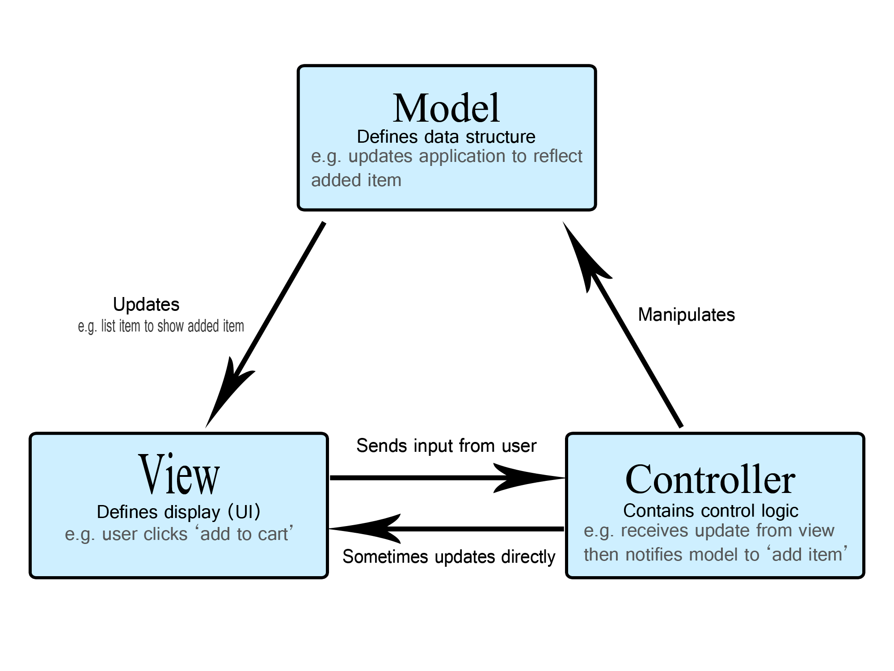

# 📚 MVC 패턴

---

## 1. 주제/키워드
- MVC 패턴의 개념과 Spring에서 이를 어떻게 구현하고 있는지 알아보자 _￠(･ω･｀)

---

## 2. 핵심 요약 (Summary)

### MVC 패턴(Model-View-Controller)
- 사용자 인터페이스, 데이터, 제어 로직을 **Model, View, Controller** 세 가지로 분리하는 아키텍처 패턴
- 소프트웨어의 비즈니스 로직과 화면을 구분 -> **관심사 분리**
- 복잡한 애플리케이션에서 **유지보수와 협업 효율성**을 높이기 위해 고안된 설계 구조
- 즉, 복잡한 데이터를 다양한 관점에서 효과적으로 제어하기 위한 패턴

---

### 구성 요소
  
| 구성 요소 | 설명 |
|-----------|------|
| **Model** | 데이터와 비즈니스 로직을 관리 (ex. DB 연동, 상태 저장) |
| **View** | 레이아웃과 화면을 처리 (ex. HTML, 화면 구성) |
| **Controller** | 모델과 뷰로 명령을 전달 |

- 
- 사용자가 View(UI)에서 add to cart를 클릭
- View는 Controller에게 사용자 입력을 전달(ex. 상품 ID)
- Controller는 Model에게 데이터 변경을 지시(ex. 상품 추가)
- Model은 내부 데이터 구조를 변경함(ex. 장바구니 table에 상품 추가)
- Model은 View에게 변경 사항 전달(ex. 업데이트 데이터 전달)
- View는 사용자에게 업데이트된 화면을 보여줌(ex. 변경된 UI 랜더링)

### Model
- 애플리케이션 데이터를 저장하고 관리
- 비즈니스 규칙을 정의하고 데이터 검증 처리
- DB와 상호작용

### View
- 사용자에게 데이터를 표시(UI)
- 사용자와 상호작용
- 데이터가 변경될 때 업데이트

### Controller
- 사용자 입력을 처리
- 사용자 작업에 따라 모델 업데이트 요청

---

### MVC 규칙

1. Model은 View, Controller에 의존하지 말아야 함
2. View는 Model만 의존하고, Controller에 의존하면 안 됨
3. View는 사용자마다 다르게 보여야 하는 데이터만 Model에서 받아야 함
4. Controller는 Model과 View에 모두 의존해도 됨
5. View는 Model의 데이터를 Controller를 통해서만 받아야 함

---

### MVC 를 사용하는 이유
- **관심사의 분리**(separation of concerns, SoC)를 통한 장점이 많음
  - 역할 분리를 통한 유지보수성 향상
    - 결합도가 낮아지기 때문에, 수정 시 영향 범위가 줄어듦
  - 재사용성과 확장성 증가
    - 각 요소가 다른 요소에서 중복으로 불러서 사용할 수 있음(같은 model을 여러 view에서 사용 가능)
  - 테스트 용이 (단위 테스트 및 통합 테스트)
    - 각 요소를 개별적으로 테스트할 수 있음
  - 협업 효율성 향상 (프론트-백 분업 구조에 적합)

---

### MVC의 단점 및 한계
- 초기 설계 복잡도 증가
- 규모 커질수록 Controller의 비대화 현상 (Massive Controller)
  - Controller가 지나치게 많은 역할을 담당하게 되면서 코드가 복잡해지고, 비즈니스 로직, 뷰 로직, 데이터 처리까지 모두 담당하게 되는 현상
- Model와 View 간 의존성 완전 제거 어려움
- 작은 프로젝트에서는 오히려 과도한 분리

---


### 대안 패턴
- MVVM (Model-View-ViewModel)
  - ViewModel을 통해 View 와 Model 간 데이터 바인딩
  - 주로 프론트엔드 프레임워크(Vue, Angular, SwiftUI)에서 사용
  - 장점: View, Model 사이의 직접 의존 제거
  - 단점: ViewModel 설계 복잡

- MVP (Model-View-Presenter)
  - Presenter가 View 로직도 일부 담당
  - View와 Model 간 의존성을 제거
  - 단점: View와 Presenter 간 의존도가 높아짐

--- 

### Spring & Spring Boot에서의 MVC 구현

- Spring Boot에서는 @SpringBootApplication 아래의 흐름이 자동 등록되어 있기 때문에, 필요한 계층만 구현하면 자동으로 연결됨

### Dispatcher이란
- Spring Web MVC에서 모든 HTTP 요청을 가로채고, 적절한 Controller에게 전달한 후, 응답을 다시 사용자에게 전달하는 중앙 허브 역할의 클래스
- Spring boot에서는 / (루트 URL)에 매핑되어 모든 요청을 가로챔
- ``` java
  doDispatch(HttpServletRequest request, HttpServletResponse response) {
      // 1. Handler 찾기
      HandlerExecutionChain handler = getHandler(request);

      // 2. HandlerAdapter 통해 실제 Controller 호출
      HandlerAdapter ha = getHandlerAdapter(handler.getHandler());
      ModelAndView mv = ha.handle(request, response, handler.getHandler());

      // 3. ViewResolver로 View 결정
      View view = resolveViewName(mv.getViewName());

      // 4. View 렌더링
      view.render(mv.getModel(), request, response);
  } 
  ```

- | 컴포넌트               | 역할                                |
  | ------------------ | --------------------------------- |
  | **HandlerMapping** | URL 요청에 대응하는 Controller를 찾음       |
  | **HandlerAdapter** | Controller를 실행할 수 있는 방식으로 호출      |
  | **ModelAndView**   | 컨트롤러가 반환한 모델+뷰 정보를 담은 객체        |
  | **ViewResolver**   | 뷰 이름을 실제 HTML/JSP 파일 경로로 매핑     |
  | **View**           | 뷰 렌더링 수행 (Thymeleaf, JSP, JSON 등) |

### DispatcherServlet 기반 흐름
```
요청

DispatcherServlet
   
HandlerMapping (어떤 Controller?)
   
HandlerAdapter (어떻게 호출할까?)
   
Controller 실행 (@RequestMapping)
   
Service -> Repository -> DB
   
Model 반환
   
ViewResolver (어떤 View로?)
   
View 렌더링 (HTML, JSON 등)
   
응답

```

### Spring 프로젝트 구조
- MVC는 3계층이지만, Spring에서는 5~6계층 구조로 세분화함 -> 유지보수 쉽도록 추가

| 계층             | 예시                                  | 역할                 | MVC         |
| -------------- | ----------------------------------- | ------------------ | --------------- |
| **Controller** | `UserController`                    | 요청 처리 및 라우팅        | **Controller**  |
| **Service**    | `UserService`                       | 비즈니스 로직 처리         | **Model**       |
| **Repository** | `UserRepository`                    | DB 접근(JPA, JDBC)   | **Model**       |
| **DTO**        | `UserRequestDto`, `UserResponseDto` | 데이터 전달 객체          | View <-> Model 매개 |
| **Entity**     | `User`                              | JPA에서 DB 테이블 대응 객체 | **Model**       |
| **View**       | HTML/JSON 응답                        | 화면 또는 API 출력       | **View**        |

- 여기서 잠깐! 왜 Service가 Model일까?
  - MVC 패턴에서의 Model 정의를 보면, 데이터와 비즈니스 로직을 담당하는 컴포넌트임
  - 따라서 데이터 (Entity), 비즈니스 로직 (Service의 로직), DB 연동 (Repository) 모두 Model에 포함

---

## 3. 참고/추가 자료 (References)
- [우아한 테크](https://www.youtube.com/watch?v=ogaXW6KPc8I)
- [MDN Web Docs](https://developer.mozilla.org/ko/docs/Glossary/MVC)
- [lango velog](https://velog.io/@langoustine/%EC%97%AC%EA%B8%B0%EB%8F%84-MVC-%EC%A0%80%EA%B8%B0%EB%8F%84-MVC-MVC-%ED%8C%A8%ED%84%B4%EC%9D%B4-%EB%AD%90%EC%95%BC)
- [Baeldung - Spring MVC Tutorial](https://www.baeldung.com/spring-mvc-tutorial)
- [스프링 웹 MVC](https://docs.spring.io/spring-framework/reference/web/webmvc.html)
- 대학 때 들었던 실습 수업 자료

---

## 4. 내일/다음에 볼 것 (Next Steps)
- DispatcherServlet 더 파보기

