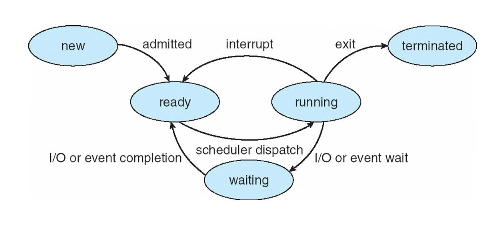

# 📚 CPU Scheduling

---

## 1. 주제/키워드
- 운영체제의 CPU Scheduling에 대해 공부해보자! ꜀(^. .^꜀  )꜆੭

---

## 2. 핵심 요약 (Summary)

### CPU Scheduling
- 여러 프로세스/스레드가 CPU 자원을 공평하게 나눠 쓸 수 있도록 관리하는 OS의 핵심 기법
- Ready Queue 속 프로세스를 선택해서 CPU에게 할당
- 그럼 어떤 기준으로 프로세스를 선택할까?
  - Preemptive(선점형) vs Non-preemptive(비선점형)
  - Preemptive(선점형): 현대 OS가 주로 사용, 프로세스 중단 후 강제로 다른 프로세스에 CPU 할당
  - Non-preemptive(비선점형): 프로세스 스스로 CPU 포기, context switching으로 인한 부하가 적음(강제 인터럽트가 없어, 스위칭 횟수가 적기 때문)
- 언제 CPU scheduling이 작동할까?
  - 빈 CPU에 할당할 프로세스 선택 필요할 때 작동
  - running -> waiting (non-preemptive)
  - running -> ready (preemptive or non-preemptive)
  - waiting -> ready (preemptive or non-preemptive)
  - terminate (non-preemptive)
  - 

---

### Dispatcher
- CPU scheduler에 의해 선택된 프로세스를 CPU에 할당하는 모듈
- 기능
  - 프로세스 간의 switching context
  - user mode로의 switch
  - 프로그램 카운터(PC) 등 context를 복원해서, 사용자 모드로 점프(실행 재개)
- 디스패처가 context switch를 실행하기 때문에, 최대한 빨라야 함!! 
- dispatcher latency: ready 상태의 프로세스가 실제로 running 상태가 되기까지 걸리는 시간 -> 최대한 짧아야 함

---

### Scheduling Criteria
- CPU utilization: CPU를 최대한 바쁘게 유지
- Throughput: time unit마다 complete되는 프로세스의 수
- **Turnaround time**: 작업 submission에서 completion까지 걸리는 총 시간
- **Waiting time**: ready queue에서 기다리고 있는 시간
- Response time: 요청에 대한 첫 번째 응답이 시작되기까지 걸리는 시간

---

### Scheduling Algorithms
  어떤 프로세스를 선택할까??

### FCFS Scheduling
- First-Come, First Served
- 가장 편리하고 심플함 -> 실제 시스템에서 최적은 아님
- **Non-preemptive**
- 프로세스 간 CPU burst time 차이가 큰 경우, 순서에 따라 성능이 많이 달라짐
- Convoy Effect(똥차 효과..)
  - burst time이 큰 프로세스가 먼저 들어온 경우, 뒤의 프로세스는 많은 시간 기다려야함

### SJF Scheduling
- Shortest-Job-First
- **Non-preemptive**, **Preemptive** 둘 다 가능
  - 만약 새로운 프로세스가 ready queue에 왔을 때, 그 프로세스가 현재 실행 중인 프로세스보다 작다면
  - 현재 프로세스를 마치고 실행 vs interrupt
- 가장 작은 CPU burst를 가진 프로세스를 선택
- 2개 이상의 프로세스가 같은 CPU burst라면 FCFS로
- short process의 waiting time을 줄이면서 average waiting time을 줄임
- 긴 프로세스가 실행되지 않는 현상(starvation)이 일어날 수 있음
- 가장 바람직한 알고리즘! 하지만 구현이 어려움(사실상 불가능)
  - 다음 next cpu burst 길이를 알 방법이 없음
  - 따라서 predict 하는 방법을 고안(이전 길이로 exponential average를 구함): SRTF(Shortest Remaining Time First)

### RR Scheduling
- Round-Robin
- **Preemptive**
- 현대 컴퓨터가 많이 사용
- time quantum을 이용한 preemptive FCFS
- ready queue를 circular queue로 생각
- time quantum 씩 잘라서 프로세스 순차적 실행
- 만약 time quantum 보다 CPU burst 시간이 작으면 -> 끝내고 다음 프로세스 실행
- 만약 time quantum 보다 CPU burst 시간이 크면 -> OS에 의해 **interrupt**가 일어남 -> context switch가 일어남 -> **현재 프로세스는 ready queue tail에 들어감** -> 다음 프로세스 실행
- Time quantum의 크기에 따라 성능이 좌우됨
  - 너무 크면 FCFS와 동일
  - 너무 작으면 context switch가 자주 발생 -> 오버헤드 발생!
- 로드밸런서의 트래픽 분산 알고리즘으로 사용

### Priority-base Scheduling
- 각 프로세스에 priority를 할당하고, 가장 높은 우선순위부터 실행
- 만약 동일한 우선순위라면, FCFS
- SJF는 CPU burst time을 우선순위로 간주한 특별한 형태의 우선순위 스케줄링
- **Non-preemptive**, **Preemptive** 둘 다 가능
- **Starvation 문제**
  - 우선순위가 낮은 프로세스는 영원히 wait만 할 수 있음
  - **Aging**으로 해결: wait 오래하는 프로세스에게 점진적으로 우선순위 높여주기

### RR + Priority Scheduling
- 기본은 Priority Scheduling을 하되, 같은 우선순위인 경우 RR

### Multi-Level Queue(MLG) Scheduling
- 용도/속성(예: interactive, batch 등)에 따라 여러 개의 ready queue를 분리해 관리

### SRF
- Shortest Remaining Time First
- **Preemptive**
- 프롯스 실행 중간에 더 짧은 프로세스가 들어오면, 기존 것을 중지하고 해당 프로세스를 실행

### 다단계 큐
- **Preemptive**
- 우선순위에 따른 준비 큐를 여러 개 사용하고, 큐 마다 다른 스케줄링 알고리즘을 적용
- 큐 간 프로세스 이동이 일어나지 않음 -> 스케줄링 부담이 적지만, 유연성이 떨어짐

---

### 스터리 질문 정리
#### OS가 필요한 이유가 무엇일까요? OS의 주요 기능을 몇 가지만 알려주세요
- 하드웨어 위에서 여러 프로그램이 안전하고 효율적으로 돌아가게 자원을 관리, 추상화하는 핵심 소프트웨어
- 필요한 이유
  - 보호/격리: 프로세스마다 독립 주소 공간과 접근 권한을 강제해 서로 침범을 막아 안정성과 보안을 높임
  -  스케줄링: 하나의 CPU(또는 여러 코어)를 시분할/컨텍스트 스위칭으로 공정하게 나눠 써서 응답성과 처리량을 확보
  -  추상화/편의: 파일, 프로세스, 가상메모리 같은 일관된 인터페이스로 개발 복잡도를 낮춤
  -  효율: 페이징, TLB, 동적 로딩, 공유 라이브러리로 메모리 및 I/O를 절약해 제한된 자원으로도 많은 작업을 동시에 수행하게 함
주요 기능
  - 프로세스 관리(생성·종료·스케줄링·IPC)
  - 메모리 관리(주소 변환, 보호 비트, 페이징/가상 메모리, TLB 캐시)
  - 파일 시스템/입출력 관리(장치 추상화·버퍼링)
  - 보호와 보안(유효/무효 비트로 접근 통제)

#### CPU 가상화와 메모리 가상화에 대해 각각 설명해주세요
- CPU 가상화: 여러 프로세스가 CPU를 동시에 쓰는 것처럼 보이게 하는 기술로, 시분할(time sharing)과 스케줄링을 통해 구현
- 메모리 가상화: 각 프로세스가 독립적이고 큰 연속 메모리를 쓰는 것처럼 보이게 하는 기술로, 실제로는 페이지 매핑과 TLB를 통해 물리 메모리와 연결

#### PC환경과 모바일 환경에서 스케쥴러 설계가 어떻게 달라져야 할까요?
- PC: 고성능 CPU와 충분한 전력 -> 공평성과 처리량을 높이는 스케줄링
- 모바일: 배터리 제약과 발열이 있어, 절전 모드/짧은 응답 지연이 중요 -> 모바일 스케줄러는 idle(CPU가 아무 작업도 안 하고 쉬는 상태) 시간을 늘리고, I/O bound 프로세스를 빠르게 처리하여 UX를 개선하는 방향으로 설계

#### MLFQ(Multi-Level Feedback Queue)에 대해서 설명하세요
- 여러 우선순위 큐를 두고 프로세스를 동적으로 이동시키는 스케줄링
- 짧고 인터랙티브한 작업은 높은 우선순위 큐에서 빠르게 처리되고, CPU를 오래 쓰는 작업은 점점 낮은 큐로 내려감
- 타임 슬라이스 설계 원칙
  - 상위 큐(우선순위 높음): 짧은 타임 슬라이스 -> 인터랙티브/짧은 작업을 빨리 처리해서 응답성 향상
  - 하위 큐(우선순위 낮음): 긴 타임 슬라이스 -> CPU를 오래 쓰는 작업을 몰아서 실행해 컨텍스트 스위치 오버헤드 줄임
- 응답성과 처리량 높아짐

#### single queue multiprocessor scheduling 문제점을 설명하고 해결할 수 있는 방법에 대해서 설명하세요
- 단일 큐에서는 같은 프로세스가 다음에 실행될 때 어느 CPU에서 실행될지 보장되지 않음 -> 캐시 지역성이 깨져 성능이 떨어짐
- 락을 사용하기 때문에, 성능이 안좋음
- 해결 방법: 각 CPU마다 로컬 큐를 두고, 주기적으로 작업을 빌려오는(work stealing) 방식 -> 부하 분산 + 캐시 친화성
- Work Stealing: CPU A의 큐가 비면 B의 큐에서 작업 훔침(캐시 지역성 깨짐 - 트레이드 오프)

#### 프로세스의 메모리 레이아웃(텍스트/데이터/힙/스택)과 각 영역의 역할을 설명하세요.
- 텍스트: 실행 코드
- 데이터: 전역/정적 변수
- 힙: 동적 할당 메모리
- 스택: 함수 호출, 지역 변수
- 스택은 위에서 아래로, 힙은 아래에서 위로 자람 -> 충돌 관리 필요

#### 선점형 vs 비선점형 스케줄링 예시와 장단점을 설명하세요. 디스패처 지연(dispatcher latency)은 왜 중요한가요?
- 선점형: 타임 슬라이스(RR)나 우선순위 기반에서 인터럽트로 현재 실행 중인 프로세스를 뺏을 수 있음, 반응성이 좋지만 컨텍스트 스위치 비용이 발생
- 비선점형: FCFS, SJF처럼 실행을 끝낼 때까지 CPU를 유지, 오버헤드가 적지만 반응성이 떨어짐
- 디스패처 지연
  - ready 상태에서 running까지 전환되는 시간 -> 시간이 길면 사용자 체감 성능이 나빠짐
  - 발생 시기: Context switch(선점형 스케줄링에서 강제 전환될 때) 
  - 줄이는 방법
    - HW: TLB에 ASID, PCID 등을 통해 TLB flush 줄이기, 빠른 컨텍스트 스위치(CPU 레지스터 저장/복원, 캐시 관리)
    - 스케줄러 관리: 타임 퀀텀이 짧으면 컨텍스트 스위치가 많아짐, 짧은 작업은 빨리 처리
    - OS 최적화: 커널 경량화, Lazy context switch(필요한 자원만 전환 시점에 교체, 나머지 지연)

---

## 3. 참고/추가 자료 (References)
- [인프런 운영체제 공룡책 강의](https://www.inflearn.com/course/%EC%9A%B4%EC%98%81%EC%B2%B4%EC%A0%9C-%EA%B3%B5%EB%A3%A1%EC%B1%85-%EC%A0%84%EA%B3%B5%EA%B0%95%EC%9D%98)
- 면접을 위한 CS 전공지식 노트

---

## 4. 내일/다음에 볼 것 (Next Steps)
- 프로세스 동기화 문제 공부

