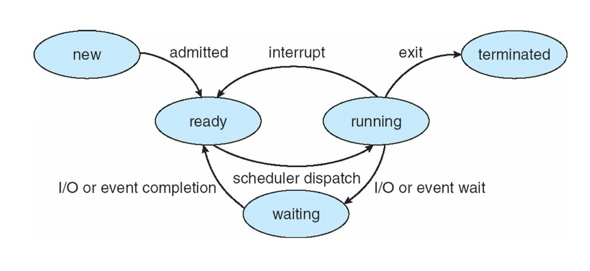

# 📚 CPU Scheduling

---

## 1. 주제/키워드
- 운영체제의 CPU Scheduling에 대해 공부해보자! ꜀(^. .^꜀  )꜆੭

---

## 2. 핵심 요약 (Summary)

### CPU Scheduling
- 여러 프로세스/스레드가 CPU 자원을 공평하게 나눠 쓸 수 있도록 관리하는 OS의 핵심 기법
- Ready Queue 속 프로세스를 선택해서 CPU에게 할당
- 그럼 어떤 기준으로 프로세스를 선택할까?
  - Preemptive(선점형) vs Non-preemptive(비선점형)
- 언제 CPU scheduling이 작동할까?
  - 빈 CPU에 할당할 프로세스 선택 필요할 때 작동
  - running -> waiting (non-preemptive)
  - running -> ready (preemptive or non-preemptive)
  - waiting -> ready (preemptive or non-preemptive)
  - terminate (non-preemptive)
  - 

---

### Dispatcher
- CPU scheduler에 의해 선택된 프로세스를 CPU에 할당하는 모듈
- 기능
  - 프로세스 간의 switching context
  - user mode로의 switch
  - 프로그램 카운터(PC) 등 context를 복원해서, 사용자 모드로 점프(실행 재개)
- 디스패처가 context switch를 실행하기 때문에, 최대한 빨라야 함!! 
- dispatcher latency: ready 상태의 프로세스가 실제로 running 상태가 되기까지 걸리는 시간 -> 최대한 짧아야 함

---

### Scheduling Criteria
- CPU utilization: CPU를 최대한 바쁘게 유지
- Throughput: time unit마다 complete되는 프로세스의 수
- **Turnaround time**: 작업 submission에서 completion까지 걸리는 총 시간
- **Waiting time**: ready queue에서 기다리고 있는 시간
- Response time: 요청에 대한 첫 번째 응답이 시작되기까지 걸리는 시간

---

### Scheduling Algorithms
  어떤 프로세스를 선택할까??

### FCFS Scheduling
- First-Come, First Served
- 가장 편리하고 심플함 -> 실제 시스템에서 최적은 아님
- **Non-preemptive**
- 프로세스 간 CPU burst time 차이가 큰 경우, 순서에 따라 성능이 많이 달라짐
- Convoy Effect(똥차 효과..)
  - burst time이 큰 프로세스가 먼저 들어온 경우, 뒤의 프로세스는 많은 시간 기다려야함

### SJF Scheduling
- Shortest-Job-First
- **Non-preemptive**, **Preemptive** 둘 다 가능
  - 만약 새로운 프로세스가 ready queue에 왔을 때, 그 프로세스가 현재 실행 중인 프로세스보다 작다면
  - 현재 프로세스를 마치고 실행 vs interrupt
- 가장 작은 CPU burst를 가진 프로세스를 선택
- 2개 이상의 프로세스가 같은 CPU burst라면 FCFS로
- short process의 waiting time을 줄이면서 average waiting time을 줄임
- 가장 바람직한 알고리즘! 하지만 구현이 어려움(사실상 불가능)
  - 다음 next cpu burst 길이를 알 방법이 없음
  - 따라서 predict 하는 방법을 고안(이전 길이로 exponential average를 구함): SRTF(Shortest Remaining Time First)

### RR Scheduling
- Round-Robin
- **Preemptive**
- time quantum을 이용한 preemptive FCFS
- ready queue를 circular queue로 생각
- time quantum 씩 잘라서 프로세스 순차적 실행
- 만약 time quantum 보다 CPU burst 시간이 작으면 -> 끝내고 다음 프로세스 실행
- 만약 time quantum 보다 CPU burst 시간이 크면 -> OS에 의해 **interrupt**가 일어남 -> context switch가 일어남 -> **현재 프로세스는 ready queue tail에 들어감** -> 다음 프로세스 실행
- Time quantum의 크기에 따라 성능이 좌우됨
  - 너무 크면 FCFS와 동일
  - 너무 작으면 context switch가 자주 발생 -> 오버헤드 발생!

### Priority-base Scheduling
- 각 프로세스에 priority를 할당하고, 가장 높은 우선순위부터 실행
- 만약 동일한 우선순위라면, FCFS
- SJF는 CPU burst time을 우선순위로 간주한 특별한 형태의 우선순위 스케줄링
- **Non-preemptive**, **Preemptive** 둘 다 가능
- **Starvation 문제**
  - 우선순위가 낮은 프로세스는 영원히 wait만 할 수 있음
  - **Aging**으로 해결: wait 오래하는 프로세스에게 점진적으로 우선순위 높여주기

### RR + Priority Scheduling
- 기본은 Priority Scheduling을 하되, 같은 우선순위인 경우 RR

### Multi-Level Queue(MLG) Scheduling
- 용도/속성(예: interactive, batch 등)에 따라 여러 개의 ready queue를 분리해 관리

---

## 3. 참고/추가 자료 (References)
- [인프런 운영체제 공룡책 강의](https://www.inflearn.com/course/%EC%9A%B4%EC%98%81%EC%B2%B4%EC%A0%9C-%EA%B3%B5%EB%A3%A1%EC%B1%85-%EC%A0%84%EA%B3%B5%EA%B0%95%EC%9D%98)

---

## 4. 내일/다음에 볼 것 (Next Steps)
- 프로세스 동기화 문제 공부

