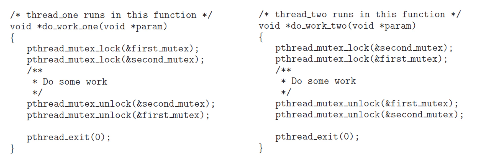
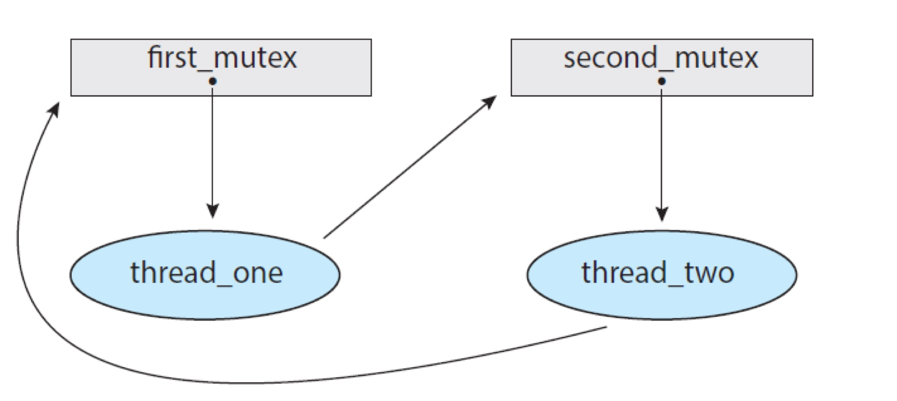
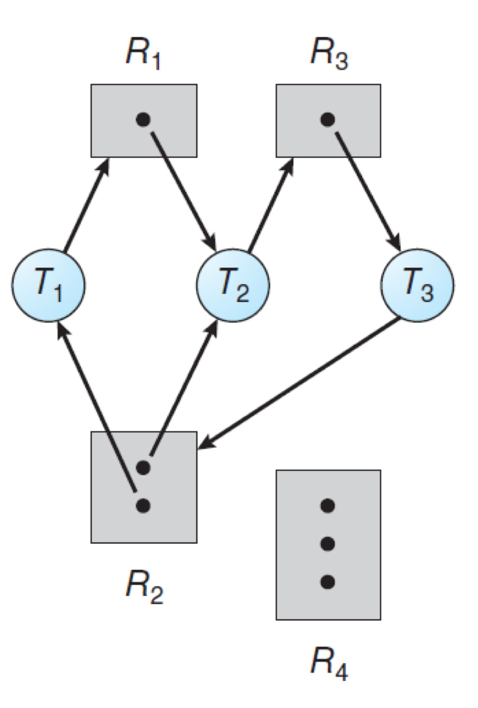
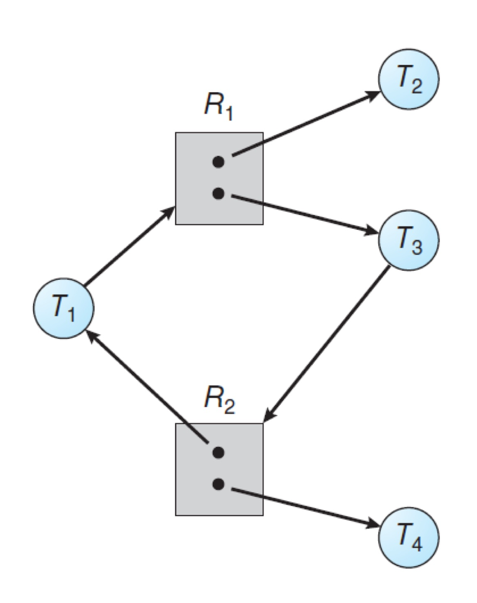

# 📚 Deadlock

---

## 1. 주제/키워드
- 운영 체제의 deadlock의 발생 원인과 해결 방법에 대해 공부해보자! (ˊ•͈ ◡ •͈ˋ)

---

## 2. 핵심 요약 (Summary)

### Deadlock
- 둘 이상의 프로세스/스레드 **서로가 점유하고 있는 자원**을 **서로 무한히 기다리기만** 하면서 아무도 더 이상 진행하지 못하는 상태
- 경쟁 상태의 스레드에 의해 공유된 여러 자원이 있다고 생각해보자!
  - 동일한 리소스 타입의 인스턴스가 존재함(아무 인스턴스에 접근해도 요청 만족)
  - 스레드는 request -> use(critical section) -> release 로 리소스에 접근
  - 2개의 스레드가 동시에 실행된다고 가정해보자!
  - 
  - `do_work_one` 스레드에서 `first_mutex`로 lock
  - `do_work_two` 스레드에서 `second_mutex`로 lock
  - `do_work_one` 에서 critical section에 진입해서 자원에 접근하기 위해서는 second_mutex lock을 얻어야하는데, 이미 다른 스레드에도 사용 중이므로 기다림. `do_work_two`도 마찬가지..
  - 따라서 두 스레드 서로의 lock 해제를 기다리며 영원히 waiting 상태 -> deadlock!!
- 그럼 언제 데드락이 발생할까?

---

### Deadlock 발생 조건(필수 조건)
1. **Mutual Exclusion**(상호 배제)
   - 최소한 하나의 리소스는 한 번에 오직 하나의 프로세스(또는 스레드)만 점유할 수 있음
2. **Hold and Wait**(점유 대기)
   - 최소 하나의 자원을 점유한 채, 추가로 다른 자원을 요청하며 기다리는 프로세스(또는 스레드)가 존재
3. **No preemption**(선점 불가)
   - 이미 할당된 자원은 강제로 빼앗을 수(선점할 수) 없고, 반드시 자원을 점유한 프로세스가 스스로 해제해야만 다른 프로세스가 가질 수 있음
4. **Circular Wait**(원형 대기)
   - 두 개 이상의 프로세스(스레드)들이 사이클 구조로 각자 다음 프로세스가 점유한 자원을 기다리는 상태

---

### Resource-Allocation Graph
- 데드락을 명확히 묘사하기 위한 그래프
- request edge: 스레드가 리소스를 요청 (thread -> resource)
- assignment edge: 리소스가 스레드에 할당됨 (resource -> thread)
- 
- Cycle 상태 -> deadlock 발생 가능!
- RAG가 사이클이 아니면 데드락이 발생하지 않음
- RAG가 사이클이면 데드락이 발생할 수도, 아닐 수도 있음
- 그러면 사이클의 데드락 여부를 판단해보자!
  - 
  - 사이클이 2개 존재
    - T1 -> R1 -> T2 -> R3 -> T3 -> R2 -> T1
    - T2 -> R3 -> T3 -> R2 -> T2
  - 만약 모든 스레드가 자원을 할당받은 상태라고 생각해보자!
  - 그래프에 나온대로, T1: R2, T2: R1, R2, T3: R3를 선점 중임
  - 근데 T1: R1을 요청 -> R1은 T2가 점유, T2: R3을 요청 -> R3은 T3가 점유, T3: R2를 요청 -> R2는 이미 T1, T2가 점유 중임
  - 즉, 각 스레드가 요청한 자원들은 이미 다른 스레드가 점유 중임
  - 모든 스레드가 자신이 원하는 자원을 다른 스레드가 점유하고 있으므로, 모두 waiting 상태 -> 데드락!

  - 
  - 사이클이 1개 존재
    - T1 -> R1 -> T3 -> R2 -> T1
  - 만약 모든 스레드가 자원을 할당받은 상태라고 생각해보자!
  - 그래프에 나온대로, T1: R2, T2: R1, T3: R1, T4: R2를 선점 중임
  - 여기서 T1: R1을 요청 -> R1은 인스턴스가 2개 존재하고, T2는 사이클에 속해있지 않기 때문에 사용이 끝나면 자원을 반납하기 때문에 T1은 R1 자원을 얻을 수 있음. T3도 마찬가지.
  - 따라서 시스템 진행에 문제가 없음 -> 데드락 아님!

---

### Deadlock Handling
1. Prevention
2. Avoidance
3. Detect and Recover

---

### Deadlock Prevention
- 데드락은 4가지 조건이 필수적으로 이루어져야, 발생 가능성이 있음
- 그렇다면, 최소 1개의 조건을 만족하지 않게 하면 발생하지 않겠네! 라는 생각..
- Mutual Exclusion
  - 모든 리소스를 공유 가능하게 하자!
  - 실제 적용 어려움(mutext lock 같은 리소스는 공유 못함, 그리고 상호 배제 없는 프로세스는 동기화 문제 발생)
- Hold and Wait
  - 스레드가 리소스를 요청할 때 다른 자원을 점유하고 있지 않도록 하자!
  - 실제 적용 어려움(지금 파일 10개를 돌리는데, 다 버리고 다시 fopen한다고만 생각해도..)
- No preemption
  - 선점이 가능하도록 하자!
  - 자원이 할당된 프로세스가 추가 자원을 요청했는데, 그 자원이 할당 불가하면 이미 점유 중이던 자원을 OS가 강제로 빼앗고(선점), 필요한 모든 자원이 한 번에 확보됐을 때만 다시 실행하게 함
  - 실제 적용 어려움(선점이 허용 시 데이터 무결성 깨지는 문제, 오버헤드 발생)
- Circular Wait
  - 모든 리소스 타입에 번호를 붙여서 순서대로 할당하자!(오름차순)
  - lock을 동적으로 얻을 수 있으면 데드락 예방을 보장할 수 없다는 문제 발생 
- prevention은 low device utilization과 reduced system throughput 문제가 있음
- 여러 문제들로 인해서 실제로 prevention 을 잘 사용하지는 않음

---

### Deadlock Avoidance
- 프로세스(또는 스레드)가 자원을 요청할 때, 그 요청을 수락하면 **데드락이 발생할 위험이 있는지** 미리 판단하여, 안전하면 할당하고, 위험하면 거절하는 방식
- Deadlock이 발생하지 않도록 시스템의 **현재/최대 자원 사용 정보**를 항상 추적해야 함
- 필요한 정보
  - 각 자원의 총 개수(최대 보유량)
  - 현재 시스템에서 할당된/남은 자원의 개수
  - 각 스레드가 최대 몇 개까지 자원을 요청할 수 있는지(**max demand**) 정보
- **Safe State**
  - 특정 순서(**safe sequence**)로 각 프로세스에게 자원을 할당해 모두가 언젠가는 반드시 원하는 작업을 끝낼 수 있는 상태
  - Safe sequence가 존재하면 **safe state**
  - Unsafe State: 반드시 데드락이 발생한다는 뜻은 아니지만, 발생할 가능성이 존재
  - 따라서 프로세스가 자원을 요청할 때, **safe state에서 벗어나게 되면 요청을 거절**
  - 즉, 항상 **safe state만 유지**!!
- 만약, 리소스 타입 하나 당 오직 하나의 인스턴스만 존재한다고 생각해보자~
  - RAG 에서 claim edge가 추가됨(나중에 요청 가능 표시)
  - cycle-detection 알고리즘을 통해 safety를 체크함
    - 만약 cycle이 없다면 요청을 수락함(safe state 유지)
    - cycle이 있다면 요청을 거절함(unsafe stae로 진입 방지)
- **Banker's Algorithm**
  - 위의 RAG 방식은 여러 인스턴스가 존재할 때 적용 못함 -> Banker
  - 자료 구조
    - Available: 각 리소스 타입별 남은(할당 가능한) 인스턴스 개수 (벡터)
    - Max: 각 스레드가 최대로 필요로 할 수 있는 인스턴스 개수 (행렬)
    - Allocation: 각 스레드에 현재 할당된 인스턴스 개수 (행렬)
    - Need: 각 스래드의 남은 필요량 (Max - Allocation)
  - Safety Algorithm
    - 현재 리소스 할당 상황에서, **safe sequence(모두가 끝낼 수 있는 순서)가 존재**하는지 확인
    - 1. Work = Available (초기화)
    - 2. 아직 종료 안 된 스레드 중 Need ≤ Work 인 스레드를 찾음
    - 3. 찾았다면, 그 스레드를 **가상으로 완료**하고
    - 4. Work = Work + Allocation (자원 반환)
    - 5. 반복해서 모든 스레드를 완료할 수 있으면 Safe, 중간에 멈추면 Unsafe
  - Resource-Request Alogorithm
    - 스레드가 새로운 자원 요청(Request)을 할 때 요청량이 Need 이하, Available 이하인지 확인
    - 1. 일단 자원을 빌려줬다고 가정(Allocation/Available/Need 임시 업데이트)
    - 2. Safety Algorithm 실행
    - 3. Safe면 진짜로 자원 할당, Unsafe면 자원 할당 거부(대기)
    - 즉, **Safe 상태 유지**가 항상 보장되는 한에서만 자원 요청 허용!!

---

### Deadlock Detection
- **데드락이 이미 발생한 상태**에서 이 상황을 **detect하고 recovery**
- 싱글 인스턴스일 때는 wait-for graph로 데드락 판별(RAG와 유사)
- 인스턴스가 여러 개일 때는, banker's algorithm와 유사하게 판별
- 그럼 언제 detection algorithm을 실행시켜야할까?
  - 데드락 발생 주기가 짧으면 실행 주기도 짧게
  - 스레드가 많을 수록 데드락 발생 확률이 높아지기 때문에 자주
  - 모든 요청에 실행하면 오버 헤드 발생
  - 하지만 특정 주기마다 실행하면 사이클이 너무 많을 수 있음
- 데드락 발생 시, 자동적으로 recover 하는 방법
  - **Process and Thread Termination**
    - 모든 데드락 프로세스 abort(데이터 손실 가능)
    - 데드락 사이클이 제거될 때까지 한번에 프로세스 하나씩 abort
  - **Resource Preemption**
    - Selecting a victim: 최소한의 피해, 오버헤드, 비용, 롤백 부담을 고려해 뭐를 선점할지 결정
    - Rollback: safe state로 roll back 후 restart
    - Starvation 주의: 동일 victim이 반복해서 선택되지 않도록 조심

---

## 3. 참고/추가 자료 (References)
- [인프런 운영체제 공룡책 강의](https://www.inflearn.com/course/%EC%9A%B4%EC%98%81%EC%B2%B4%EC%A0%9C-%EA%B3%B5%EB%A3%A1%EC%B1%85-%EC%A0%84%EA%B3%B5%EA%B0%95%EC%9D%98)

---

## 4. 내일/다음에 볼 것 (Next Steps)
- 실제 개발하면서 데드락 발생 가능성 고민해보기

