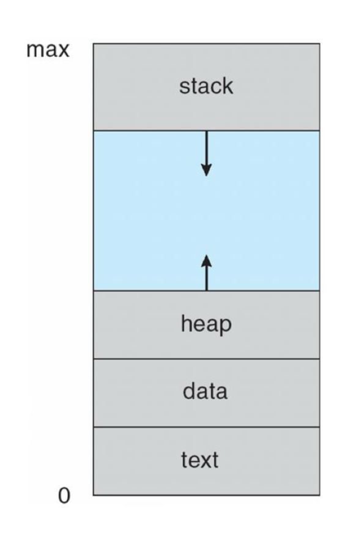
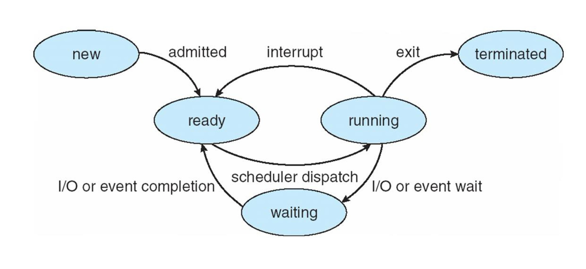
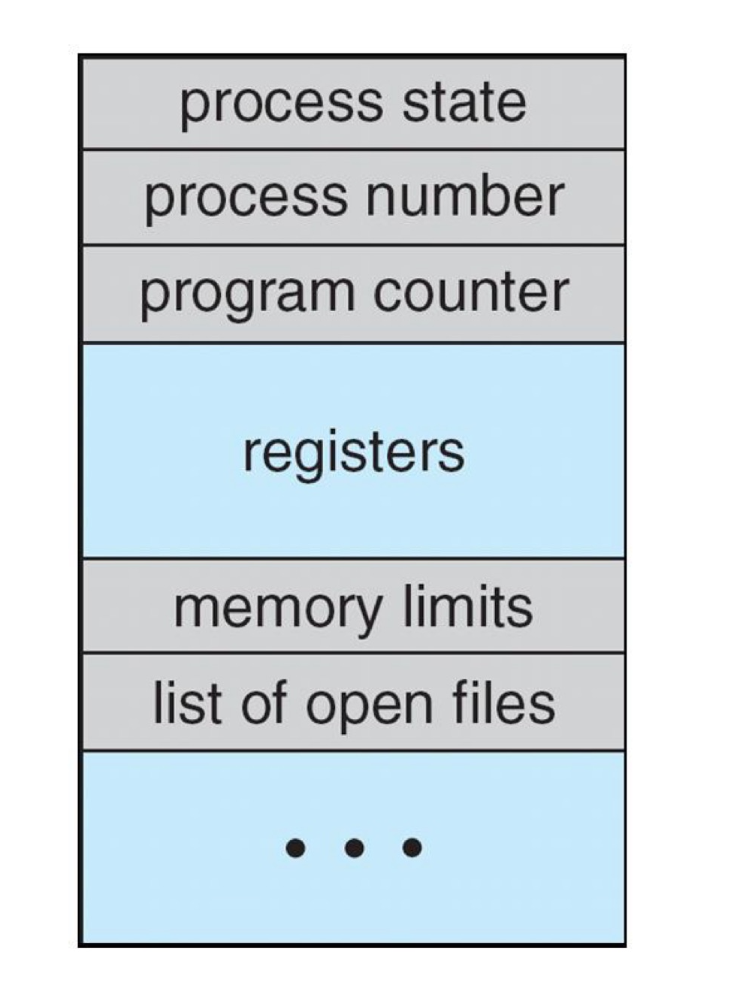
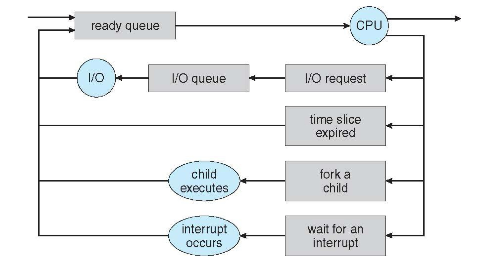
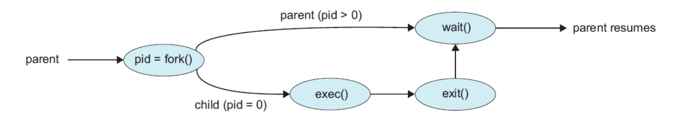
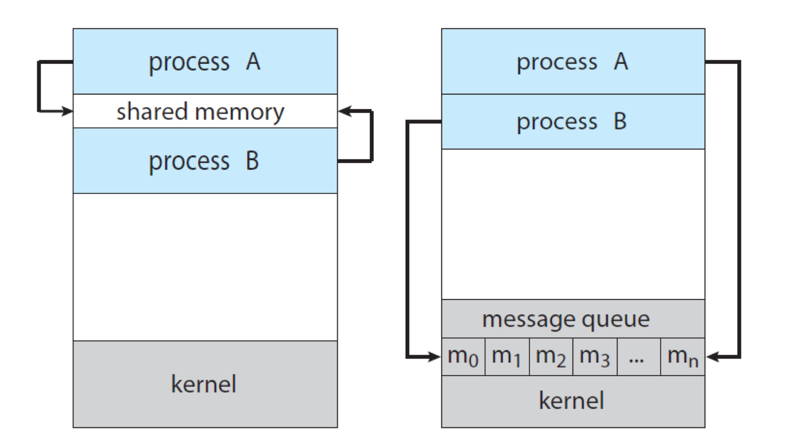

# 📚 Process

---

## 1. 주제/키워드
- 운영체제의 Process에 대해 알아보자~ 〜(￣△￣〜)

---

## 2. 핵심 요약 (Summary)

### Process란?
- 실행 중인 프로그램(프로그램 + 실행 상태)
- 프로세스의 메모리 구조
  - stack: 함수 파라미터, 리턴 주소, 지역 변수 등
  - heap: 동적 할당 메모리(malloc, new 등)
  - data: 전역/정적 변수
  - text: 실행 코드(명령어)
  - 
- Process State(상태)
  - New: 생성 중
  - Running: 실행(명령어 처리 중)
  - Waiting: I/O 등 이벤트 발생 기다림
  - Ready: CPU 할당 기다림(메모리에 올라가 있는 상태)
  - Terminated: 실행 종료됨
  - 

--- 

### PCB(Process Control Block)이란?
- OS가 각 프로세스를 관리하기 위해 사용하는 자료구조
- process state, program counter, CPU register, stack pointer 등 실행 컨텍스트 정보 포함
- 

--- 

### Process Scheduling
- **Mutiprocessing**
  - **여러 개의 CPU core**에서 각 프로세스를 물리적으로 병렬 실행
  - **Time Sharing**도 활용 (멀티코어든, 단일코어든 time-slice 단위로 context switch)
- Scheduling Queue
  - Ready Queue: CPU 할당을 기다리는 프로세스 목록
    - 대기 중인 상태에서 PCB 링크드 리스트로 관리됨
  - Wait Queue: 이벤트(I/O, 신호 등)를 기다리는 프로세스 목록
  - 
- **Context Switch**
  - 현재 실행중인 프로세스의 **context**(상태)를 PCB에 저장
  - 다른 프로세스의 context를 PCB에서 불러와서 CPU 실행을 전환
  - 즉, 프로세스 간에 CPU를 바꿔주는 핵심 기술!

--- 

### Operations on Process
- OS는 process 생성, 종료 기능 필수 제공
- Parent Process는 Child Process를 생성(`fork`)
- child는 parent의 **메모리(코드, 데이터)를 복사**해서 시작(완전 독립적)
- 부모는 child 종료까지 `wait()`로 대기(**동기화**)
  - parent/child는 concurrently(동시에) 실행됨
- child는 `exec()`로 새로운 프로그램 실행 가능 (**메모리 전체 교체**)
- 
- zombie process: child가 종료됐는데 parent가 wait()를 안 해서 아직 남아 있는 상태(죽었지만 PCB 남음)
- orphan process: parent가 먼저 종료되고 child가 남은 상태

--- 

### 여기서 잠깐!! 공부해도 해도 맨날 헷갈리는 용어 정리하기 ᕦ( •ᗜ•)ᕤ
### Program vs Process
- Program
  - 코드(명령어)+데이터의 정적(Static)인 파일 (예: .exe, .class, .py 등)
  - 메모리에 올라가지 않은 상태
- Process
  - 메모리에 올라가(적재되어) 실행 중인 프로그램
  - 운영체제가 관리하는 단위 (프로그램 + 실행 상태/컨텍스트)
  - -> **실행 중에만 "Process"임!**

### Multiprocessing vs Multiprogramming vs Multitasking
- Multiprocessing
  - **여러 CPU Core**를 동시에 사용하여 여러 프로세스를 병렬 실행
  - ex: 쿼드코어 PC에서 4개의 프로세스가 각자 동시에 돈다
- Multiprogramming
  - **하나의 CPU**에 여러 프로그램을 메모리에 동시에 올림
  - CPU는 하나지만 여러 작업을 번갈아 수행(**context switch**)
- Multitasking
  - 여러 작업(프로세스/스레드)을 거의 동시에 처리
  - **Time sharing**을 통해 OS에서 사용자가 여러 프로그램을 동시에 실행하는 것처럼 보이게 만듦
  - 요즘 OS는 대부분 멀티태스킹 기반

### Process vs Thread vs Context
- Process
  - **실행 중인 프로그램의 인스턴스**
  - 독립된 **메모리 공간**(코드, 데이터, 힙, 스택) 가짐
  - OS가 관리 (각 프로세스마다 OS가 "PID"로 식별)
  - 크롬 켜고(1번), 메모장 켜고(2번) → 각각의 "프로세스"가 따로 동작
- Thread
  - **프로세스 내부에**서 실행 흐름의 최소 단위
  - **하나의 프로세스**는 **여러 개의 스레드**를 가질 수 있음
  - **메모리(코드, 힙, 데이터)는 공유**하고, **스택/레지스터 등 일부만 따로 가짐**
  - 멀티스레드 프로세스:
    - 크롬에서 여러 탭, 다운로드, 렌더링이 동시에 동작 -> 내부적으로 여러 "스레드"로 분리

| 구분    | 프로세스               | 스레드                   |
| ----- | ------------------ | --------------------- |
| 정의    | 실행 중인 프로그램 인스턴스    | 프로세스 내 실행 흐름 단위       |
| 메모리   | 독립(코드, 데이터, 힙, 스택) | 코드, 데이터, 힙 공유, 스택은 개별 |
| 소유권   | OS가 관리(PID)        | 프로세스가 소유              |
| 생성/종료 | 상대적으로 느림(오버헤드 큼)   | 빠름(가벼움)               |
| 예시    | 크롬, 메모장, 터미널       | 크롬 탭, 다운로드, 렌더링       |

- Context
  - **프로세스/스레드가 실행 중인 "상태(정보)"**
  - 프로그램 카운터(PC), 레지스터, 스택 포인터 등
  - OS가 context를 저장해 두었다가, 다시 실행할 때 복원(restore)해서 이전에 멈춘 곳부터 이어서 실행
  - context = "프로세스/스레드가 지금 어디까지, 무슨 정보까지, 어떤 데이터까지 진행했는지" 에 대한 정보
  - 즉, 다음에 이어서 실행하려면 반드시 알아야 할 모든 상태/정보!!

### Context Switch vs Time Sharing
- Context Switch
  - CPU가 현재 실행 중인 프로세스/스레드의 상태(context)를 저장
  - -> 다른 프로세스/스레드의 상태(context)를 "불러와서" CPU에 할당
  - 즉, **실행 중인 작업을 바꾸는 과정**
  - 이때 context는 PCB/TCB에 저장해 둠
  - **오버헤드 발생** 가능성이 있음 (switch 비용 발생)

- Time Sharing
  - **한 개의 CPU**를 여러 프로세스/스레드가 "순서대로" 짧은 **시간**씩(타임슬라이스) 나눠서 사용하는 방식
  - "한 순간엔 하나만" 실행하지만, OS가 아주 빠르게 context switch를 반복 -> 여러 작업이 동시에 실행되는 것처럼 보임!
  - 사용자는 마치 동시에 여러 프로그램이 동작하는 것처럼 느낌 (실제로는 매우 빠른 번갈아 실행임)
  - **Time Sharing이 동작할 때마다 필연적으로 context switch가 발생함**
  - 즉, time sharing이 context switch를 "유발"하는 구조!

- 정리하자면.....
- 영화관(프로세스 3개)에서 한 명(=CPU)이 영화 3개를 5분씩 번갈아 보며 "실시간 중계"한다고 생각
  - 5분 보고 영화1 "일시정지"(context 저장)
  - 영화2로 이동, 5분 보고 또 "일시정지"
  - 영화3로 이동, 5분 보고 또 "일시정지"
  - 다시 영화1 "이어보기"(context 불러옴)
  - ... 반복
- 이때 "일시정지/이어보기"가 **context switch**
- 5분씩 번갈아 보는 그 구조가 **time sharing**

---

### Interprocess Communication
- 동시에 실행되는 프로세스는 independent 하거나 cooperating 함
  - Independent: 다른 프로세스의 상태에 전혀 영향받지 않는 프로세스 (데이터도 전혀 공유X)
  - Cooperating: 서로 정보(데이터)를 공유하거나 영향을 주고받는 프로세스
- IPC(Inter-Process Communication)
  - 데이터 교환을 허용하는 cooperating process는 IPC mechanism을 필요로 험
  - 즉, send data, receive data가 필요
  - IPC에는 두 모델이 존재: shared memory, message passing
  - 

---

### Shared Memory
- Producer-Consumer Problem
  - producer은 consumer에게 정보를 제공함 -> 어떻게 concurrently하게 두 프로세스를 작동시킬 것인가
- shared memory
  - 커널(운영체제)이 공유 메모리 공간을 만들어주고, 두 프로세스가 이 공간을 **동시에** 접근해 데이터 주고받음
  - 따라서 sync(동기화, mutex, semaphore 등) 관리 필요 (**동시성 문제 발생!**)
  - 프로그래머가 직접 동기화 코드를 짜야 하므로, 사용이 어렵지만 빠름
  - 실행 방식
      - 부모/자식, 혹은 관련 프로세스가 `shm_open`으로 공유 메모리 생성/접근
      - `ftruncate`로 크기 설정
      - `mmap`으로 실제 주소 매핑 데이터 공유
      - 동기화(세마포어, 뮤텍스 등) 직접 구현
- POSIX(Portable Operating System Interface)
  - IPC mechanism
  1. create: `shm_open`
  2. size 설정: `ftruncate`
  3. 메모리 매핑: `mmap`

---

### Message Passing
- 커널(운영체제)이 메세지 큐/포트/파이프 등 매개체를 제공
- 직접 메모리 공유 대신, 커널을 통해 **메시지**를 주고받는 방식
- 속도는 공유 메모리보다 느리지만, 프로그래밍 쉽고, 프로세스 간 보안 높음
- `send(message)` / `receive(message)`
- Communication Link
  - 만약, 두 프로세스 P와 Q가 소통하고 싶으면, 이 comm.link를 통해 소통 가능
  - 이 때, 이 링크는 direct/indirect, synchronous/asynchronous 할 수 있음
  - Direct Communication
    - sender, receiver의 이름을 명시적으로 작성
    - `send(P, message)`: 프로세스 P에게 메세지 전송
    - `receive(Q, message)`: 프로세스 Q에게 메세지 받기
    - 링크가 자동적으로 생성, **정확히 2개의 프로세스에 1개의 링크가 생성**
  - Indirect Communication
    - mailbox/port를 이용해 중간에서 간접적으로 메시지 주고받기
    - `send(A, message)`: 포트 A에게 메세지 전송
    - `receive(A, message)`: 포트 A에게 메세지 받기
    - sender, receiver 둘 다 공유하는 포트가 있는 경우에만 링크 생성
    - 1개의 링크에 2개 이상의 프로세스가 연결되어있을 수 있음
    - 같은 페어라도 다른 링크들이 존재할 수 있음(포트에 따라 생성되기 때문)
  - Blocking(Synchronous)
    - send/receive가 상대방 동작까지 기다림
    - Send: 메시지를 보낸 뒤, 상대방(수신자)이 메시지를 받을 때까지 보내는 쪽(sender)이 대기(block)함
    - Receive: 메시지를 받을 때, 도착한 메시지가 없으면 받는 쪽(receiver)이 메시지가 올 때까지 대기(block)함
  - Non-Blocking(asynchronous)
    - send/receive가 바로 리턴 (queue에 쌓이거나, 없으면 null 리턴)
    - Send: 메시지를 보내고 바로 다음 작업을 수행할 수 있음. 메시지가 큐에 쌓이거나, 큐가 꽉 차 있으면 실패를 바로 알 수 있음
    - Receive: 메시지가 도착해 있으면 즉시 받고, 없으면 null 등 특별한 값을 리턴하고 바로 다음 작업을 수행함
- Pipes
  - IPC mechanism
  - Ordinary Pipes
    - parent가 pipe를 생성하여 child와 소통
    - 2개의 프로세스만 허용, unidirectional함 -> one-way communication만 허용
    - 양방향 communication이 필요하면 pipe 2개 사용
    - `pipe(int fd[])`: 파이프 생성
    - `fd[0]`: read end / `fd[1]`: write end

---

### Socket
- 네트워크 통신에 특화된 IPC (얘도 Pipe 방식)
- IP address + port number 로 구성(ex. 123.45.6.7:80)
- Java에서는 socket interface를 제공
  - `Socket`: connection-oriented(TCP)
  - `DatagramSocket`: connectionless(UDP)

---

## 3. 참고/추가 자료 (References)
- [인프런 운영체제 공룡책 강의](https://www.inflearn.com/course/%EC%9A%B4%EC%98%81%EC%B2%B4%EC%A0%9C-%EA%B3%B5%EB%A3%A1%EC%B1%85-%EC%A0%84%EA%B3%B5%EA%B0%95%EC%9D%98)

---

## 4. 내일/다음에 볼 것 (Next Steps)
- 프로세스 동기화 문제
- 메시지 큐(message queue)

