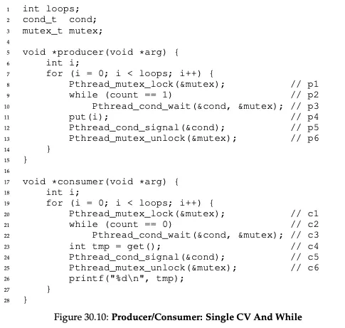

# 📚 Synchronization

---

## 1. 주제/키워드
- 운영체제의 경쟁 상태와 해결 방법에 대해 알아보자~ ( •̀∀•́ )✧

---

## 2. 핵심 요약 (Summary)
### Synchronization
- 여러 프로세스가 동시에 실행되면, 공유 자원에 동시에 접근하는 경우가 발생하고, 이는 데이터의 모순이 일어날 수 있음
- 따라서 우리는 프로세스의 공유 자원 접근을 안전하게 하도록 동기화 -> 데이터 무결성 유지
- 데이터 공유가 일어나는 순간
  - Concurrent excution
    - interrupt가 일어나 다른 프로세스로 할당
    - CPU 1개여도 context switch로 동시에 실행되는 것처럼 보임
  - Parallel execution
    - 여러 코어에서 여러 프로세스 병렬로 실행
- 그러면 언제 데이터 무결성이 깨질까?
  - producer&consumer 예시: sum++, sum-- 하는 두 프로세스가 비동기적으로 실행된다고 생각해보자
  - 
  - 결과값이 0일거라 생각하지만, 아닌 경우가 발생! 왜 그럴까?
  - 단순한 sum++ 도 기계어 수준으로 생각해면 ``register = sum`` ``register = register+1`` ``sum = register`` 으로 3개의 작업으로 나눠짐
  - 즉, 이 중 어디서 context switch가 발생할 지 모름 -> 발생 위치에 따라 결과값이 달라짐(interleaved 하게 배치됨) -> 데이터 무결성 깨짐!!
  - 
  - 이를 **Race Condition**이라고 함

---

### Race Condition
- 여러 프로세스 혹은 스레드가 같은(공유하는) 자원으로 동시에 접근할 때, 결과값이 특정 순서에 따라 달라지는 현상
- 따라서 우리는 한 타임에 오직 하나의 프로세스(스레드)만 공유 자원에 접근하도록 설정해야함! -> 상호 배제(Mutual exclusion)
- 이를 위해 프로세스를 동기화 -> **process(thread) synchronization**

---

### Critical Section
- 다른 프로세스와 공유하는 데이터를 접근하고 수정하는 프로세스의 코드 블럭
- 하나의 프로세스가 critical section에서 실행 중이라면, 다른 프로세스는 해당 영역을 실행할 수 없음
- 코드 구역
  - entry section: critical section 진입을 위한 permission을 요청
  - critical section
  - exit section
  - remainder section
- 구현 요구 사항
  - **Mutual Exclusion**
    - 이미 critical section에 실행 중인 프로세스가 있다면, 다른 프로세스는 접근 불가
    - deadlock, starvation 문제를 발생시킬 수 있음
  - **Progress**(avoid deadlock)
    - 임계영역에 아무도 들어가 있지 않을 때, 진입을 원하는 프로세스들 중에서 언젠가는 반드시 **한 프로세스가 임계영역에 들어갈 수 있도록 결정이 진행**되어야 함
  - **Bounded Waiting**(avoid starvation)
    - 어떤 프로세스(스레드)가 critical section 진입을 요청하면, 다른 프로세스들이 그 임계영역에 들어가는 횟수가 일정한 한계(bound)를 넘지 않는 하도록 하여, **반드시 언젠가는 임계영역에 진입할 수 있다는 보장**
- 멀티 프로세스에서 mutual exclusion
  - Non-preemptive kernel
    - race condition 문제 발생하지 않음 -> 느려서 거의 사용 안함
  - Preemptive kernel
    - 구현이 어렵지만 responsive

---

### Peterson's Solution
- Critical Section 문제의 소프트웨어 해결법
- flag로 현재 critical section에 진입했음을 알림
- 
- **정확히 실행되 것이란 보장이 없음** -> 기계어 단위가 아닌 코드 단위이기 때문
- 하지만 이론적으로 mutual exclution, progress, bounded waiting을 모두 만족

---

### Hardware Support for Synchronization
- 결국 정확한 동기화를 위해서는 하드웨어 단위의 설정이 필요함
- 기본 작업
  - memory barriers or fences
  - hardware instructions
  - atomic variables
- Atomic variables 이란?
  - 하드웨어 명령어 단위로 절대 쪼개지지 않는 연산    
  - ex. test_and_set, compare_and_swap
  - ``lock``을 통해 mutual exclusion 구현

---

### 동기화를 위한 software tool
- Mutex Lock: 가장 단순
- Semaphore: 더 안전, 편리, 효율적
- Monitor: Mutex Lock, Semaphore 단점 보완
- Liveness: 프로세스가 progress를 만들게 함

---

### Mutex Lock
- Mutex: **mut**ual **ex**clusion
- 임계 영역을 지키고, 경쟁 상태를 방지
- critical section에 진입 전에 꼭 **lock**을 얻고, 나갈 때 해제
- ``acquire()`` `release()` `available`(lock 사용 가능 여부)
  - `acquire()` `release()`은 **atomically**하게 작동
- 
- **Busy waiting** 문제 발생
  - lock을 얻기 위해 무한 루프를 돌아야 함 -> CPU 낭비
  - 하지만 **Spinlock**이라 생각해보자!(럭키비키~)
    - **context switch가 없기 때문에**(루프 도는 곳은 atomically하기 때문) 오버 헤드 발생 줄어듦, 시간 절약
    - long critical section에는 비효율적

---

### Semaphore
- integer의 변수(lock 역할, 사용 가능한 자원 개수)로 프로세스 제어하는 방식
- `wait()`, `signal()` (둘 다 atomic)
- 
- 종류
  - Binary Semaphore: 0, 1로 이루어짐 -> mutex lock과 유사
  - Counting Semaphore
    - 사용 가능한 자원 개수로 semaphore 값 선언
    - wait: count-- signal: count++
    - count=0이면 모든 자원이 사용 중 -> block
- 민약 s1 다음에 s2가 실행되어야한다고 가정
  - s=0 으로 선언
  - p1: s1, signal
  - p2: wait, s2
  - 따라서 p1 signal 에서 s=1이 되고, p2 wait에 접근 가능함
- 세마포어의 busy waiting
  - `wait()`에서 0 이하일 때 waiting queue
  - `signal()`이 실행됐다면, waiting queue -> ready queue 올리기

---

### Monitor
- 세마포어가 좋긴 한데.. timing error가 발생 가능
- 예를 들어, wait와 signal 순서가 바뀐다거나, signal 대신 wait를 작성했다거나...
- 따라서 데이터와 연산을 하나의 객체(모듈)로 캡슐화하여 임계구역의 진입/퇴장(락 관리)을 자동으로 제공하는 ADT로 안전하게 사용 -> monitor
- Java에서 지원하는 monitor
  - `synchronized`: 임계 영역 코드 블록 선언
  - `wait()`: 모니터락 획득을 위한 wait 상태 진입
  - `notify()`: 대기 중인 스레드 깨움

---

### Liveness
- 시스템(혹은 알고리즘) 내의 각 실행 흐름(프로세스, 스레드 등)이
언젠가는 반드시 자신이 원하는 동작(임계영역 진입, 작업 완료 등)을 할 수 있다는 보장
- Semaphore과 monitor은 progress, bounded-waiting을 만족하지 못할 수 있음 -> liveness 만족 못할 가능성 존재
- deadlock: 영원히 대기
- priority inversion
  - 낮은 우선순위가 자원을 선점하고 있어, 높은 우선순위가 기다리는 현상
  - priority inheritance로 해결
    - 낮은 우선순위가 선점하는 동안, 일시적으로 높은 우선순위를 상속받아 그 행동을 하는 것

---

### 스터디 질문 정리
#### 스핀락의 단점을 설명하고 어떤 방식으로 개선할 수 있을 지 설명하세요
- 단점: 락 대기 중 CPU를 낭비하며 Busy Wait
- 개선: 짧은 임계 구역에만 사용, 일정 시간 후 Sleep으로 전환(Hybrid Lock)
- 멀티코어 환경에서 유리, 단일코어 환경에서는 비효율적

#### 식사하는 철학자 문제를 해결할 방법을 2개 이상 설명해보세요
- 자원 순서를 정해 Deadlock 방지(한 방향으로 젓가락 집기)
- 세마포어를 N-1로 설정 -> 모든 철학자가 동시에 집지 못하게 제한
- 우선순위 부여

#### dead lock 예방, 해결, 피하는 방법을 설명하세요
- 예방: 4조건 중 하나 제거 (예: 자원 순서 정하기)
- 해결: Deadlock 감지 후 recover(abort, rollback)
- 회피: Banker's Algorithm으로 안전 순서만 허용

#### 세마포어가 수행할 수 있는 역할을 설명하고 값을 어떻게 세팅해야하는지 말하세요
- 역할: 임계 구역 동기화, 다중 자원 접근 제어
- Binary Semaphore(0/1): Mutex처럼 동작
- Counting Semaphore(n): n개의 자원을 동시에 허용

#### 가상 메모리에서 Page Fault가 동시성에 어떤 영향을 줄 수 있나요
- 페이지가 메모리에 없으면 디스크 I/O로 불러와야 해 스레드가 block
- 그 사이 컨텍스트 스위칭 증가로 오버헤드가 생기고 CPU 효율이 떨어짐
- 여러 스레드가 동시에 fault 나면 I/O 큐 병목으로 지연 발생
- 락 보유 스레드가 fault 나면 모두가 대기하는 convoy 효과로 동시성이 더 낮아짐
- 결과적으로 지연 분포 악화(p95/p99 높아짐), 전체 처리량 감소

#### TLB Miss가 Context Switching 시 더 많이 발생하는 이유는?
- TLB는 가상 -> 물리 주소를 캐싱함. 컨텍스트 스위치로 주소 공간이 바뀌면 이전 TLB 엔트리 대부분이 무효화
- 새 프로세스는 초기 접근 때마다 TLB miss -> 페이지 테이블 워크가 발생
- 이 과정에서 TLB/캐시 지역성이 깨져 지연 발생
- 따라서 스위치가 자주 발생할 때 TLB miss 누적으로 처리량이 감소

#### 아래의 코드에서 잘못된 부분을 찾고 고칠 방법은? + 잘못 작동하는 예시
- 
- 단일 cond를 producer/consumer가 공용으로 써서 signal()이 잘못된 쪽을 깨우면 둘 다 while 대기되는 문제(지연 발생)
- 만약 count=1 인 상황이라고 가정하면 producer은 wait 인 상태인데 만약 스케줄러가 producer을 깨우면 다시 wait로 들어감(단일 cond이기 때문에 producer, consumer 중 누굴 깨울지 구분안함) -> 재 wait로 인한 스위치 낭비, 큐 대기 증가
- 수정: 조건변수를 cond_not_empty(소비자용) / cond_not_full(생산자용)으로 분리

---

## 3. 참고/추가 자료 (References)
- [인프런 운영체제 공룡책 강의](https://www.inflearn.com/course/%EC%9A%B4%EC%98%81%EC%B2%B4%EC%A0%9C-%EA%B3%B5%EB%A3%A1%EC%B1%85-%EC%A0%84%EA%B3%B5%EA%B0%95%EC%9D%98)

---

## 4. 내일/다음에 볼 것 (Next Steps)
- 데드락!

