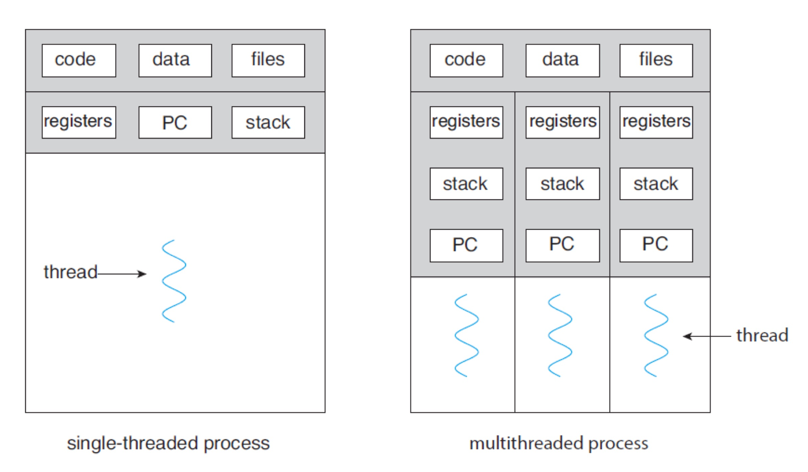
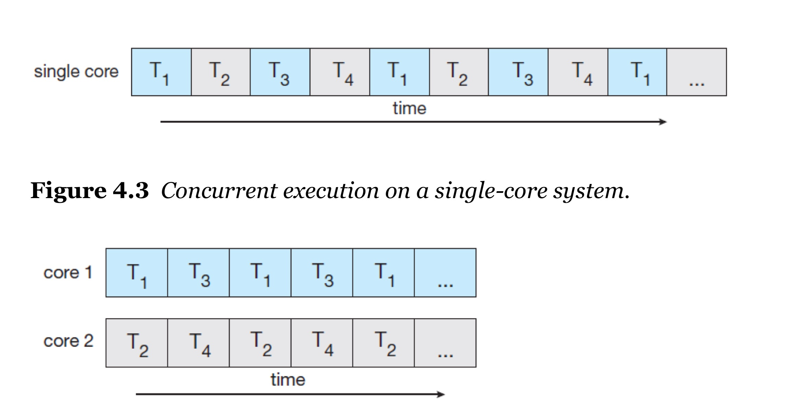

# 📚 Process

---

## 1. 주제/키워드
- 운영 체제의 Thread에 대해 공부하자!! ♪( ´θ｀)ノ

---

## 2. 핵심 요약 (Summary)
### Thread란
- 가벼운 버전의 프로세스 -> 프로세스 내 실행 흐름의 최소 단위 (lightweight process라고도 부름)
- CPU에서 스케줄되는(실행되는) 단위
- **각 스레드는 stack/register set/program counter을 갖고, 같은 프로세스의 코드, 데이터, 힙 등은 공유**

- 싱태(State)
  - New: 생성됨 (start 전)
  - Runnable: 실행 가능, 스케줄러 대기 중
  - Running: CPU에서 실행 중
  - Blocked/Waiting: I/O 등 이벤트 대기
  - Terminated: 실행 종료

---

### User Thread vs Kernel Thread
- User Thread
  - 커널(운영체제) 관여 없이, 사용자 레벨에서 직접 관리되는 스레드
  - OS는 “스레드 존재” 자체를 모를 수도 있음 (쓰레드 라이브러리가 직접 스케줄링)
  - 문제: 한 user thread가 block되면(예: I/O), 전체 process가 block될 수 있음

- Kernel Thread
  - OS가 직접 스케줄링/관리하는 스레드
  - 커널이 thread context switch 처리
  - 대부분의 최신 OS(JVM, Python, 리눅스, 윈도우)는 커널 스레드 사용

- 모델 정리
  - Many-to-One: 여러 user thread -> 1 kernel thread에 매핑 (성능 제한, block 문제)
  - One-to-One: 1 user thread = 1 kernel thread (대부분의 현대 OS)
  - Many-to-Many: 여러 user thread <-> 여러 kernel thread (효율과 유연성 높음, 구현 복잡)

---

### Multithreading을 사용하는 이유?
- **Responsiveness**
  - UI, 서버 등에서 하나의 작업(block) 때문에 전체가 멈추지 않고, 다른 스레드가 계속 응답
- **Resource Sharing**
  - 동일 프로세스 내 스레드끼리는 코드/데이터/힙 모두 공유 가능
  - 단, 동기화 문제(데이터 경합, race condition) 주의!!!
- **Economy**
  - **프로세스보다 스레드 생성/전환 비용(오버헤드)이 훨씬 작음**
- **Scalability**
  - 멀티코어 환경에서 병렬 처리로 성능 향상 (프로세스 간 병렬성보다 효율/성능/자원 소비가 좋음)

---

### Muticore에서 Mutithreading
- 멀티코어+멀티스레딩으로 성능/동시성 향상!!
- 코어 수 증가 = 병렬 작업 효율 증가
- 단, 암달의 법칙 때문에 무조건 성능이 좋아지는 것은 아님 (순차 부분이 병목)

- 주의할 점
  - 동기화(synchronization)
    - 여러 스레드가 같은 데이터/리소스를 쓸 때, mutex, semaphore, lock 등으로 동시 접근을 안전하게 제어
  - Race condition/Deadlock
    - 동기화 실패 시 데이터 꼬임, 교착상태 발생 가능
  - Thread-safe 설계
    - 멀티스레드 환경에 안전하게 동작하는 코드 작성 필요

---

### Process vs Thread
| 구분    | 프로세스(Process)       | 스레드(Thread)          |
| ----- | ------------------- | -------------------- |
| 메모리   | 독립 (코드/데이터/힙/스택 분리) | 코드/데이터/힙 공유, 스택 개별   |
| 생성/전환 | 비용 큼 (heavyweight)  | 비용 적음 (lightweight)  |
| 충돌    | 별로 없음 (자원 공유X)      | 자주 발생 (공유 자원 동기화 필요) |

---

### 간단하게 알아보는 동기화(Synchronization) 문제

- **Race Condition (경쟁 상태)**
  - 여러 스레드(또는 프로세스)가 **동시에 같은 데이터(공유 자원)를 읽고/쓰면서, 실행 순서에 따라 결과가 달라질 수 있는 상황**
  - ex. 은행 계좌에서 동시에 입금/출금하는 두 스레드가 있을 때, 순서에 따라 최종 잔고가 달라지는 문제

- **Deadlock (교착 상태)**
  - 여러 스레드가 **서로 자원을 점유한 채, 상대방의 자원을 기다리면서 영원히 멈추는 상황**
  - ex. 스레드A는 리소스1을, 스레드B는 리소스2를 잡고 있음. A는 2를, B는 1을 필요로 해서 서로 **양보 없이** 무한정 기다림

- **Livelock (활락 상태)**
  - 교착 상태처럼 보이지만, **서로 계속 양보(상태 변화)는 하는데, 실제로는 아무 진전도 없는 상태**
  - ex. 좁은 복도에서 두 사람이 서로 비켜주려고 계속 왔다갔다만 하다가, 결국 아무도 앞으로 못 가는 상황

- 더 자세한 내용은 다음 공부로... ❛‿˂̵✧

---

## 4. 참고/추가 자료 (References)
- [인프런 운영체제 공룡책 강의](https://www.inflearn.com/course/%EC%9A%B4%EC%98%81%EC%B2%B4%EC%A0%9C-%EA%B3%B5%EB%A3%A1%EC%B1%85-%EC%A0%84%EA%B3%B5%EA%B0%95%EC%9D%98)

---

## 5. 내일/다음에 볼 것 (Next Steps)
- 동기화 문제!!!

