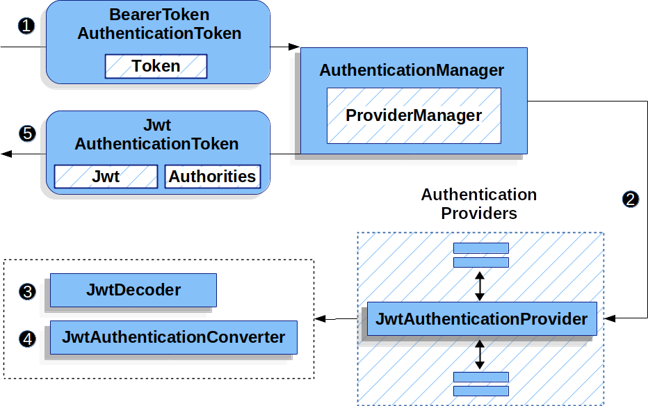

# 📚 Spring Security - JWT

---

## 1. 주제/키워드
- Spring Security 기반 JWT 개발에 대해 알아보자! (b˙◁˙ )b

---

## 2. 핵심 요약 (Summary)
 ### JWT(Json Web Token)란?
  - 사용자/서버가 "인증/권한" 정보를 짧은 문자열(토큰)에 담아서 주고받는 것
  - **stateless** -> client가 나 이 토큰 가지고 있어! 하면 인증하는 방식
  - ``aaa.bbb.ccc`` 와 같이 .(점)으로 구분된 3개 파트로 구성됨
    - **Header**: 토큰 타입(JWT), 서명 알고리즘 정보
    - **Payload**: 유저 정보, 권한 등 데이터 (ex. userId, role)
    - **Signature**: 토큰의 위변조 판별을 위해 header+payload+서버가 가지고 있는 key를 header에서 정의한 알고리즘으로 **암호화**해서 붙임
  - 동작 방식
      1. client가 sever에 로그인 요청을 보냄
      2. server가 client에게 accessToken, refreshToken 발급
      3. client는 받은 accessToken을 로컬 스토리지에 저장(cookie 등)
      4. client는 API 요청 때마다 Header에 accessToken을 담아 보냄
      5. server는 JWT 인증을 하고, 통과되면 Payload 속 유저 정보를 컨트롤러/서비스에서 유저 데이터를 조회할 때 사용(userId, role 등)
      6. 만약, accessToken이 만료되면 client는 refreshToken을 통해 새로운 accessToken을 발급받음
      7. 만약, refreshToken도 만료되면, 1번으로 돌아감

### 여기서 궁금한 점!
- accessToken을 사용하는 이유?
   - 추가 세션없이 인증/인가가 가능 -> stateless
   - 중간에 accessToken 탈취가 되어도, 시간 만료되면 사용 불가하기 때문에 비교적 안전
- accessToken vs JWT?
  - JWT는 토큰의 형태/규격(포맷) -> JWT로 만든 토큰이 accessToken이 될 수도, refreshToken이 될 수도 있음
- accessToken 만료 시 동작 방식
   - 401 Unauthorized 응답 -> 클라이언트는 refreshToken을 서버에 제출 -> 서버는 refreshToken이 DB/Redis에 있고, 아직 유효한지 확인 -> 유효하다면, 새로운 accessToken을 발급해서 클라이언트에게 응답
- refreshToken 관리
   - 탈취되면 위험해서 항상 DB/Redis에서 관리, 유출, 문제 감지시 즉시 폐기 가능

### Spring Security 에서 JWT Authentication 동작 방식
1. Autientication ``Filter`` 가 HTTP 요청에서 ``Token`` 을 꺼냄
2. 토큰을 ``BearerTokenAuthenticationToken``이라는 객체에 담아서 ``AuthenticationManager``에 전달
3. ``ProviderManager``는 JWT 인증만 전담하는 ``JwtAuthenticationProvider`` 라는 놈한테 인증 처리를 맡김
4. ``JwtAuthenticationProvider``는 ``JwtDecoder``를 사용하여 전달받은 토큰을 **decode** 하고, **검증(서명 확인)**, **유효성 체크(만료/위조)**
5. 그리고 ``JwtAuthenticationConverter``를 사용하여 JWT 안에 들어있는 **role**이나 **권한** 정보들을 granted authorities(권한 목록)로 바꿔줌
6. 인증이 성공하면, ``JwtAuthenticationToken`` 객체가 만들어지고, 이 안의 principal(=유저 정보)은 JWT에서 파싱한 값을 가지고 있음. 인증 정보가 ``SecurityContextHolder``(=스프링에서 인증정보 저장소)에 세팅됨
    > **🔥 따라서 컨트롤러/서비스에서 @AuthenticationPrincipal이나 SecurityContextHolder.getContext()로 유저 정보 꺼내 쓸 수 있음**



---

## 3. 예제 코드/활용법 (Example)
```java
// Filter
@Override
protected void doFilterInternal(HttpServletRequest request, HttpServletResponse response, FilterChain filterChain) throws ServletException, IOException {
  // 1. 헤더에서 토큰 추출
    String token = resolveToken(request);
    // 2. 토큰 유효성 검사
    if (token != null && jwtTokenProvider.validateToken(token)) {
      // 3. 인증 정보 생성 → SecurityContext에 등록
      Authentication auth = jwtTokenProvider.getAuthentication(token);
      SecurityContextHolder.getContext().setAuthentication(auth);
    }
    // 4. 필터 체인 계속 진행
    filterChain.doFilter(request, response);
}
```

## 4. 실전 적용/느낀 점 (Usage & Insights)
- [연관 이슈](https://github.com/Sunwoo0110/Bookdam-backend/issues/1)
  - JwtAuthenticationFilter, JwtTokenProvider 개발
  - 사실 spring 에서 jwt 관리하는 방식이 어느정도 규격화가 되어 큰 고민 없이 개발한 적이 많았던 것 같은데... 이번 기회에 공부 하면서 어떤 방식으로 작동하는 지 배워서 뿌듯했다😙

---

## 5. 참고/추가 자료 (References)
  - [Spring Security 공식 문서](https://docs.spring.io/spring-security/reference/servlet/oauth2/resource-server/jwt.html)
  - 대학 때 들었던 보안 및 네트워크 강의 기억 더듬기... ✧⁺⸜(･ ᗜ ･ )⸝⁺✧
  - 산학 프로젝트 코드 분석

---

## 6. 내일/다음에 볼 것 (Next Steps)
- Session 기반 인증 방식과의 차이점
- 코드 분석

